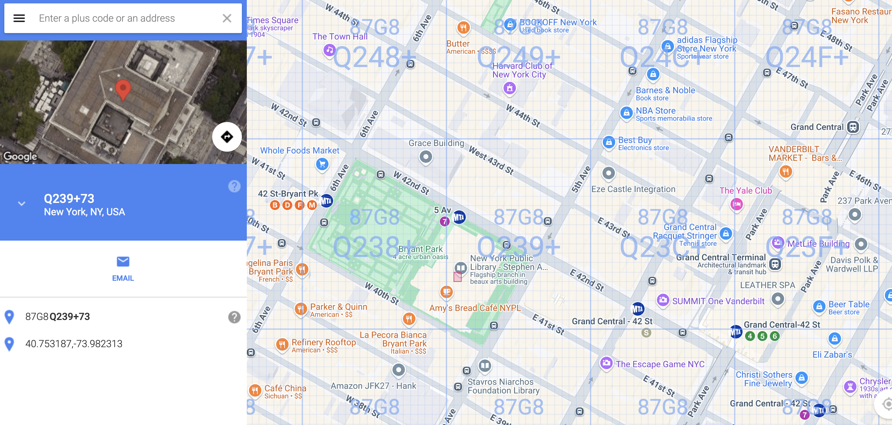

# Clue / Information
The team over at Turbo Tactical successfully got access to a discussion over on [GhostTown](https://ghosttown.deadface.io/t/lets-meet/62) between DEADFACE members mort1cia and gh0st404 looking to meetup in real life. It would be a big win for the team to be able to alert the local authorities, but they can’t seem to identify the precise location given the file that was included in the thread. Can you harness all of your analytical techniques to identify the exact coordinates of the meeting?

Submit the flag as: flag{text+tt} using the 11-character Plus Code format.

# Resolution
Same as Cup_of_Compromised_Joe through Google Lens I identified that it's the New York Public Library, precisely the Rose Main Reading Room https://lens.google.com/search?ep=gsbubb&hl=fr-CH&re=df&p=AbrfA8oxY55zncUDptWFIbs5zNNSy4-mTNTGNWNdbnWkxrbOapcPwnOAoC2OILW654uQ2kB0z0rmXFxZm1qGC4Cob3JWMZ5oA24yueGE1zhoK3k97sIWeNNWU-rD9TjrAvw1y0WXxQ74KJrdICQdCd-FnpnS3ThQBWUq-KrERzYXLPcy6cJ6EumtyPBO9cUFPVchJses_evv7TovPA%3D%3D#lns=W251bGwsbnVsbCxudWxsLG51bGwsbnVsbCxudWxsLG51bGwsIkVrY0tKRE5rT0RnNU9UWmtMVE0yWm1JdE5HVm1NUzFpTkRZMUxUY3hNMk0yTWpJd09HVXpPUklmYjE5MlVXRkxZMWt4TjJObE5FWXpjRVF5ZGpoaFkzTjFZMTlGUVV0b2F3PT0iLG51bGwsbnVsbCxudWxsLG51bGwsbnVsbCxudWxsLG51bGwsWyJjYjhhOTg5OC0xMzJjLTQ0MGEtOWI5My01NzhlMGUyZDZkNTkiXV0=

The exact photo can be found on this site: https://nyc.eu/visit-new-york/attractions/public-library/

Now for the [11-character Plus code format](https://en.wikipedia.org/wiki/Open_Location_Code)

Now to get the precise position ... maybe ask admin for clue/indication

https://plus.codes/87G8Q239

Tried flags:
	flag{Q239+94+tt}
	flag{87G8Q239+94+tt}
	flag{87G8Q239+tt}
	flag{87G8Q239+73}
	flag{87G8Q239+74}
	flag{87G8Q239+66}
	flag{87G8Q239+67}
	flag{87G8Q239+F3}
	flag{87G8Q239+C3}
	flag{87G8Q239+82}
	flag{87G8Q238+8X}
	flag{87G8Q238+6W}
	flag{87G8Q238+7W}
	flag{87G8Q238+9X}
	flag{87G8Q238+6V}
	flag{87G8Q239+92}
	flag{87G8Q238+FX}
	flag{87G8Q238+1X}
	flag{87G8Q239+1X}

Using the Grid option of [plus.codes](https://plus.codes/87G8Q239+73) allow to see that the Library is mostly in the rectangle identied with `87G8Q239+`, now we have to find the value of `tt` ...


The conversation with an admin:
```
> Hey, so I found the location, the New York Public library, more precisely the Rose Main Reading Room, I found a site where the same image is used: https://nyc.eu/visit-new-york/attractions/public-library/ I looked a bit on this site but didn't found something that helped me
Now for the format https://plus.codes/87G8Q239+, I determined that the first codes must be 87G8Q239 or 87G8Q238 since they are the one with the library inside, but for what comes after the + I tried some position (after looking at plans of the building to get the right rectangle) with a precision of 2 characters but not good for the moment
thanks for your help
> RP01 - Deadface Staff
So the path is not discovering the location of the image
> kiki
So using what is said in https://ghosttown.deadface.io/t/lets-meet/62/2 the library could be the first place to meet up and then, since they "we can go grab some beers and chat" find the closest bar or something like that ...
> RP01 - Deadface Staff
Analyze the image
lego my stego
> kiki
mmhhh ... I don't see something obvious, this is excpected lol, only that the position where the image was taken might not be at the center of the room but more at one side of the room ... but since the path is not about discovering the location of the image
> RP01 - Deadface Staff
\
\
\
\
\
\
\
\
😉
> kiki
Well thanks for the help, I'll try to understand those clue !
```
