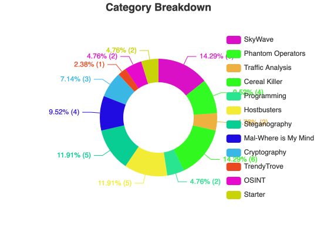

# Challenges Resolved
We do not include any Welcome or Start Up challenges (2 in this CTF).
| Challenge Name | Category |
| -------------- | -------- |
| Cup of Compromised Joe | OSINT |
| Compromised Immune System | OSINT |
| SkyWave 1: High Tower | SkyWave, SQL |
| SkyWave 2: Trifecta | SkyWave, SQL|
| Winning Factors | Programming |
| Big Fish | Phantom Operators, Traffic Analysis |
| SkyWave 9: Updates | SkyWave, SQL |
| SkyWave 3: Rabbit Ears | SkyWave, SQL |
| Something in the Dark | Steganography |
| Ides-le Talk | Crypto
| Image of the Beast | Cereal Killer, Steganography |
| Cereal Killer 01 | Cereal Killer, Reverse Engineering |
| Social Pressuse | Crypto |
| She's got Issues | Cereal Killer, OSINT |
| Cereal Killer 02 | Cereal Killer, Reverse Engineering |
| Let Me In | TrendyTrove, SQL & Web |
| Cereal Killer 05 | Cereal Killer, Reverse Engineering |
| Password | Phantom Operators, Traffic Analysis |
| Suspicious Sender | Phantom Operators, Traffic Analysis |
| Electric Soldiers | Steganography |
| Offsite Targets | Steganography |
| Syncopated Beat | Steganography |
| SkyWave 4: Longest Run| SkyWave, SQL |
| Logical Left and Rational Right | Crypto |
| Data Breach | Traffic Analysis |
| Mal-Where is My Mind 00 | Mal-Where is My Mind, Reverse Engineering |
| Mal-Where is My Mind 01 | Mal-Where is My Mind, Reverse Engineering |
| Mal-Where is My Mind 02 | Mal-Where is My Mind, Reverse Engineering |
| Landing Zone | Hostbusters, ... |
| Mind Your Surroundings | Hostbusters, ... |
| Mal-Where is My Mind 03 | Mal-Where is My Mind, Reverse Engineering |
| Short-Term | Hostbusters, ... |
| Price Check | Steganography |
| Eavesdropper | Hostbusters, ... |
| Send It | Hostbusters, ... |
| Missing Pieces | Programming |
| Cereal Killer 03 | Cereal Killer, Reverse Engineering |
| Wild Wild West | Traffic Analysis |
| Right Time | Phantom Operators |
| SkyWave 5: Connections | SkyWave |

# Challenges Attempted
| Challenge Name | Category |
| -------------- | -------- |
| Let's Meet | OSINT & Steganography |
| SkyWave 6: Handoff | SkyWave, SQL |

# Writeups
- [DEADFACE CTF 2024 Walkthroughs, by TheZeal0t](https://www.youtube.com/watch?v=YXRf9HqrYg4)
- [DEADFACE CTF 2024 Steganography Write-Up](https://cyberhacktics.com/deadface-ctf-2024-steganography-write-up/)
- [DEADFACE CTF some Crypto and OSINT](https://medium.com/@Thetruthseeker613284/deadface-2024-rp01-writeups-8d9363bbc530)
- [DEADFACE CTF some OSINT, Forensics and Crypto](https://mghacker.notion.site/DEADFACE-CTF-WriteUps-123c219ae31e8062b11ef56fd677088a)
- [DEADFACE CTF some Crypto and Reverse Engineering](https://github.com/D0pp3lgang3r/CTF-WU/blob/master/DEADFACE/wu.md)
- [DEADFACE CTF some Crypto, SQL, Traffic Analysis, MISC](https://github.com/x03ee/DeadFaceCTF-2024)
- [DEADFACE CTF some MISC/PWN](https://rmi78.github.io/posts/Deadface-CTF/)
- [DEADFACE CTF some Forensics](https://right-owl-ed2.notion.site/Deadface-Writeup-126135448db880d6b975d792efe4f2fe)
