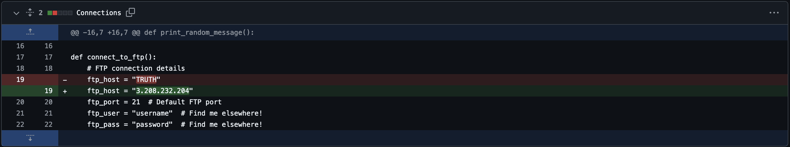

# Clue / Information
Note: This DOES NOT require any attacking or brute forcing. Please DO NOT attack any IP addresses. If credentials are needed, they must be found.

Your brother and private investigator, Jake Grahambell, was working on a high-profile case when he mysteriously disappeared two weeks ago. The last time you spoke, he mentioned traveling to a remote location and hinted at being in some kind of trouble. There have been rumours spreading in GhostTown about his disapearance as well. Can you piece together the clues and use your OSINT skills to uncover what happened to your brother?

Submit the flag as flag{flagtext}.

# Resolution
This [post](https://ghosttown.deadface.io/t/dumping-the-world/61) has a mention of 'Jake Grahambell'.
The data that one hacker got from a SSN dump:
```
SSN 035-55-4683
Name: Jake Grahambell
Birthday-04-02-1998
Address; 102 NotReal St, Smithstone, AL
Twitter: [x.com](http://x.com/OpticSeltzer69)
```

A SSN beginning with '035' corresponds to an Area Location Code for the state of Rhode Island.

I tried getting more info using the SSN
- [035-55-4683 is Invalid](https://www.ssn-check.org/verify/035-55-4683)

To bypass the login blockup: https://xcancel.com/OpticSeltzer69

Google lensing the profile image gives us an amazon page: https://www.amazon.com/stores/author/B0CJ9VQJY5?ingress=0&visitId=62aa330e-8620-48b8-8936-919d0ad504ea

The github repo from his first tweet: [we end up on a 404](https://github.com/OpticSeltzer/Tictactoeeee)

The github user from his biography: https://github.com/Adorable-Welcome-268

This user has 2 repo: 'TheTruth' and 'TRUTH'.
'TheTruth' has a `.md` file
```md
# TheTruth
THIS IS THE TRUTH ABOUT THEM
```

'TRUTH' holds a python file called 'Connections' and is forked 5 times
```python
import ftplib
import random

def generate_random_number():
    return random.randint(1, 100)

def print_random_message():
    messages = [
        "The quick brown fox jumps over the lazy dog.",
        "Python is awesome!",
        "FTP stands for File Transfer Protocol.",
        "Always remember to secure your connections.",
        "Coding is fun and challenging."
    ]
    print(random.choice(messages))

def connect_to_ftp():
    # FTP connection details
    ftp_host = "TRUTH"
    ftp_port = 21  # Default FTP port
    ftp_user = "username"  # Find me elsewhere!
    ftp_pass = "password"  # Find me elsewhere!

    try:
        # Establish FTP connection
        ftp = ftplib.FTP()
        ftp.connect(ftp_host, ftp_port)
        ftp.login(ftp_user, ftp_pass)

        print(f"Successfully connected to FTP server at {ftp_host}")

        # List contents of the root directory
        print("Contents of root directory:")
        ftp.dir()

        # Close the connection
        ftp.quit()
    except ftplib.all_errors as e:
        print(f"FTP connection failed: {str(e)}")

# Main script execution
if __name__ == "__main__":
    print("Welcome to the random FTP connection script!")

    # Generate and print a random number
    random_num = generate_random_number()
    print(f"Random number: {random_num}")

    # Print a random message
    print_random_message()

    # Attempt FTP connection
    print("\nAttempting FTP connection...")
    connect_to_ftp()

def simulate_dice_roll():
    return random.randint(1, 6)

def random_color():
    return f"#{random.randint(0, 0xFFFFFF):06x}"

def random_geometric_shape():
    shapes = ["Circle", "Square", "Triangle", "Rectangle", "Pentagon", "Hexagon"]
    return random.choice(shapes)

def random_math_operation():
    a = random.randint(1, 20)
    b = random.randint(1, 20)
    operations = [
        ("+", lambda x, y: x + y),
        ("-", lambda x, y: x - y),
        ("*", lambda x, y: x * y),
        ("/", lambda x, y: x / y if y != 0 else "undefined")
    ]
    op, func = random.choice(operations)
    result = func(a, b)
    return f"{a} {op} {b} = {result}"

def random_fibonacci(n):
    fib = [0, 1]
    for i in range(2, n):
        fib.append(fib[i-1] + fib[i-2])
    return fib
```

When opening the details for the forks, we have only one repo as entry: https://github.com/kabirdjain/TRUTH
He commited some modifications on 'Connections':


We have the address `3.208.232.204` of the server we have to connect to and the port `21`.
They even say to us that we need to find the credentials (username, password) elsewhere
```bash
> nc 3.208.232.204 21
220 Microsoft FTP Service
```

I tried `USER ` with all pseudo of the members of deadface, but always got `451 The parameter is incorrect.`
I also tried some common FTP server commands that chatgpt gave me but always ended up with `451 The parameter is incorrect.`

If we take the address to a web browser we end up in a Turbo Tactical mirror.
There is the following comment in the `<head>`
```html
<!--
Deadface members, I have created a phishing site mirroring Turbo Tacticals website. Lets phish some usernames so we can create JWT tokens
and gain access to the admin portal on their website. flag{the_one_the_only_bad_coding_practices}
-->
```
